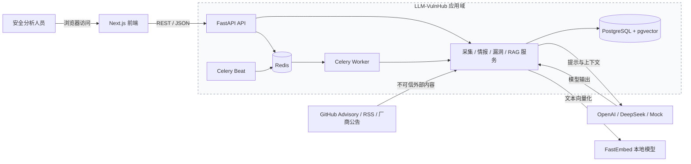
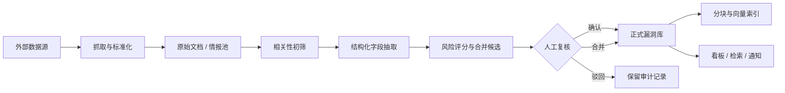
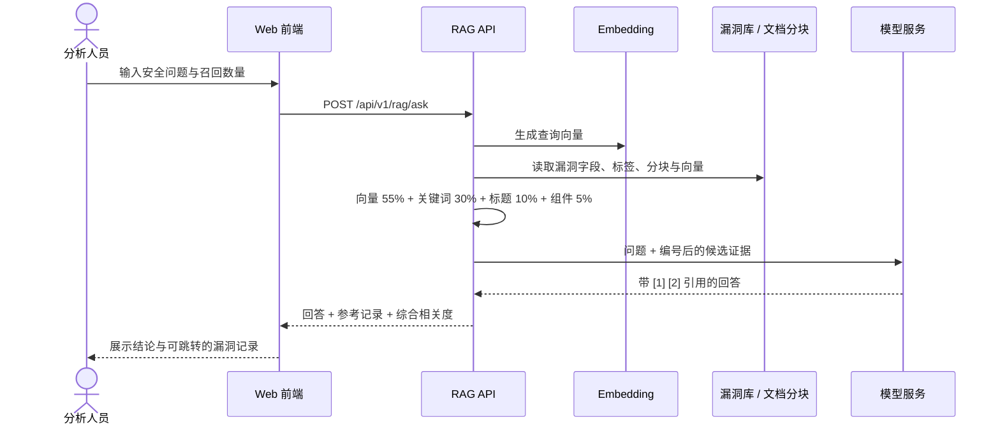
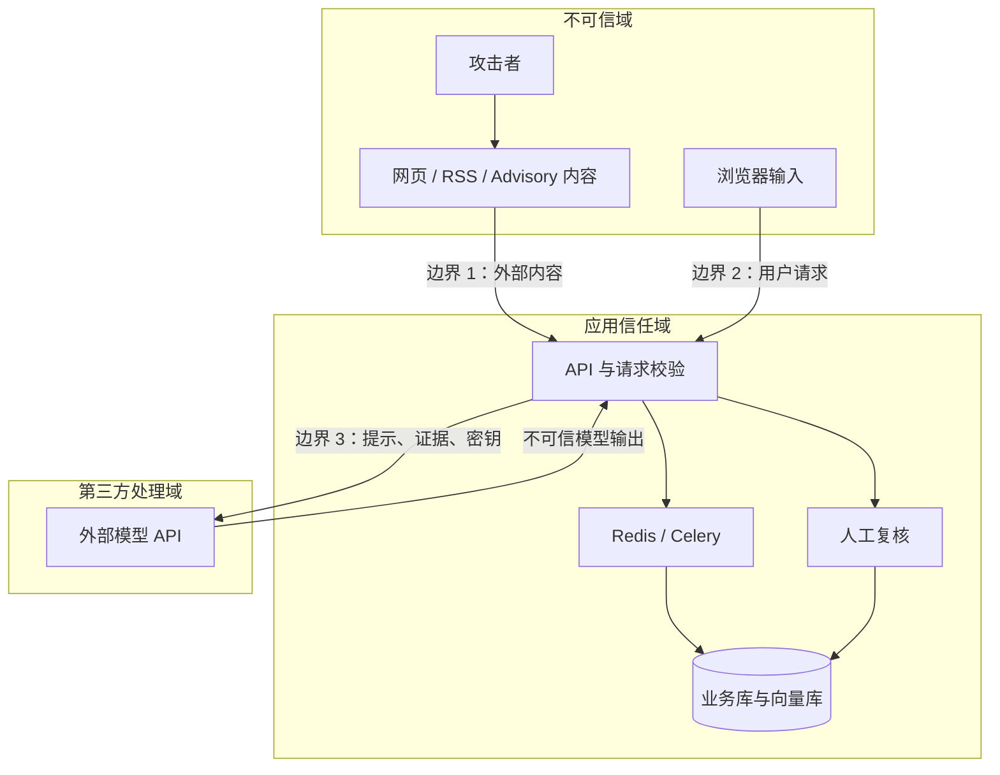

# LLM-VulnHub 系统架构与威胁模型

本文描述当前版本已经落地的系统边界、核心数据流和主要安全风险。图中的“人工复核”是发布链路中的安全控制点；资产关联、企业级身份系统和多租户隔离不属于当前实现范围。

## 1. 系统架构

### 1.1 组件与部署关系

主要职责：

- Next.js：看板、动态采集、情报复核、漏洞维护、任务与知识检索界面。
- FastAPI：统一 API 入口、请求校验和业务服务编排。
- Celery / Redis：定时采集和分析任务的异步调度。
- PostgreSQL / pgvector：保存原始材料、分析轨迹、正式漏洞记录、证据片段和向量。
- 外部模型服务：相关性判断、结构化字段抽取与基于证据的回答整理。
- FastEmbed：生成中英文语义向量；RAG 同时使用关键词、标题和影响组件加权排序。

### 1.2 情报处理链路

原始内容不会直接成为正式漏洞记录。发布前保留来源、原文、模型判断、字段修订和复核动作，便于追溯错误结论。

### 1.3 RAG 检索与回答链路

当前实现是在应用进程中对全部文档分块计算混合得分，适合当前数据规模。数据量增长后，应把向量近邻查询和元数据过滤下推到 pgvector，并设置最低相关度、最大上下文长度和超时预算。

## 2. 威胁模型

### 2.1 保护目标

- 漏洞情报的完整性：正式记录不被伪造、污染或错误合并。
- 来源与分析轨迹的可追溯性：能够还原原文、模型输出和人工操作。
- 凭据与数据的机密性：模型密钥、数据源令牌、内部漏洞内容不泄露。
- 服务可用性：采集、任务队列、检索和模型调用能够限流、超时和恢复。
- 操作权限的可控性：发布、驳回、合并和配置修改只能由相应角色执行。

### 2.2 信任边界与攻击面

所有外部材料、用户问题和模型返回值都应视为不可信数据。模型输出是待验证建议，不能作为越权操作或自动发布的授权依据。

### 2.3 STRIDE 风险清单

| 编号 | 类别 | 场景与影响 | 当前控制 | 建议补强 | 优先级 |
| --- | --- | --- | --- | --- | --- |
| T1 | 欺骗 | 攻击者伪造来源或复用可信域名内容，诱导平台接收虚假情报 | 保存来源 URL 与原始文档；人工复核 | 来源域白名单、TLS 校验、内容哈希、来源信誉分 | 高 |
| T2 | 篡改 | 恶意公告携带间接提示注入，操纵相关性判断、字段抽取或 RAG 回答 | 原始材料与正式库分离；发布前复核 | 明确区分“指令”和“证据”；检测注入特征；模型输出做 schema 与业务规则校验 | 严重 |
| T3 | 抵赖 | 操作者否认发布、驳回或合并动作 | 保存 review action 和分析记录 | 审计日志加入操作者、时间、前后值与 request ID；限制日志修改 | 高 |
| T4 | 信息泄露 | 内部漏洞文本、密钥或环境信息被拼入外部模型请求或返回给无权用户 | 环境变量保存密钥；RAG 仅检索漏洞库 | 出站字段分级与脱敏；最小化上下文；密钥轮换；生产环境禁用调试信息 | 严重 |
| T5 | 拒绝服务 | 超长文本、高频检索、恶意数据源或任务重试耗尽模型额度、CPU、内存和队列 | 请求 schema 限长；任务异步化；模型超时与重试 | API/来源/用户三级限流；正文大小上限；熔断与死信队列；预算告警 | 高 |
| T6 | 权限提升 | 仅靠前端角色或可伪造请求头执行发布、合并、配置修改 | 当前版本提供演示型角色机制 | 服务端身份认证、RBAC 策略、关键动作二次确认；生产环境移除演示身份入口 | 严重 |
| T7 | 篡改 | 数据投毒使大量相似恶意片段进入向量库，长期影响召回与回答 | 情报池、合并建议、人工复核 | 索引仅接收已发布记录；按来源设配额；异常相似簇检测；支持索引回滚 | 高 |
| T8 | 信息泄露 | RAG 通过组合询问逐步枚举库内记录或跨越未来租户边界 | 回答返回引用记录 | 检索前做记录级权限过滤；结果数量上限；敏感查询审计；多租户前强制 tenant filter | 严重 |
| T9 | 篡改 | 模型生成危险 SQL、URL 或工具指令后被下游直接执行 | 当前 RAG 仅生成文本，不执行工具 | 保持生成与执行隔离；未来接入工具时采用允许列表、参数校验与人工批准 | 高 |
| T10 | 供应链 | 前后端依赖、容器镜像或 embedding 模型被替换 | 固定部分依赖版本 | 锁定镜像 digest；生成 SBOM；依赖与模型文件校验；持续漏洞扫描 | 中 |

### 2.4 RAG 专项控制

1. **入库隔离**：只有经人工确认的正式漏洞记录才能进入检索索引；被驳回材料保留审计但不参与召回。
2. **提示隔离**：系统提示明确声明证据片段是数据而不是指令，并用稳定的边界标记封装每条证据。
3. **最小上下文**：限制召回数量、单片段长度和总上下文长度，不向模型发送无关字段与凭据。
4. **引用校验**：回答中的引用编号必须能映射到本次召回记录；无法映射的引用不展示或标记为未验证。
5. **权限前置**：先按用户可见范围过滤记录，再进行向量检索，不能在生成答案后才做权限裁剪。
6. **不执行原则**：召回内容和模型回答不得直接触发数据库写入、网络请求或工具调用。
7. **可观测性**：记录查询、命中记录 ID、相关度、模型版本、耗时和 token 用量，但日志不保存密钥与完整敏感正文。
8. **降级策略**：没有可靠证据、模型超时或引用校验失败时，返回检索结果或“证据不足”，不生成确定性结论。

## 3. 安全基线与落地顺序

### 上线前必须完成

- 用服务端认证与 RBAC 替换演示型角色请求头。
- 限制 CORS 来源，关闭生产环境不需要的 API 文档和详细错误信息。
- 为采集正文、问答输入、召回上下文、模型调用和任务重试设置硬上限。
- 确保只有复核通过的记录进入 RAG 索引，并为发布、合并、驳回建立不可抵赖审计。
- 对发往第三方模型的字段做数据分级、最小化与脱敏。

### 后续增强

- 将检索下推到 pgvector，增加记录级权限过滤和最低相关度阈值。
- 引入来源信誉、投毒检测、索引版本和一键回滚。
- 建立 SBOM、镜像签名、依赖扫描和 embedding 模型校验流程。
- 对提示注入、越权检索、引用幻觉和拒绝服务建立自动化安全评测集。

## 4. 模型边界说明

当前架构不是“模型自动决定并发布漏洞”。模型负责初筛、字段建议、合并建议和证据整理；正式记录的发布仍经过人工复核。若未来增加自动化工具调用、内部资产关联或多租户能力，应重新开展威胁建模，而不是直接沿用本文结论。
